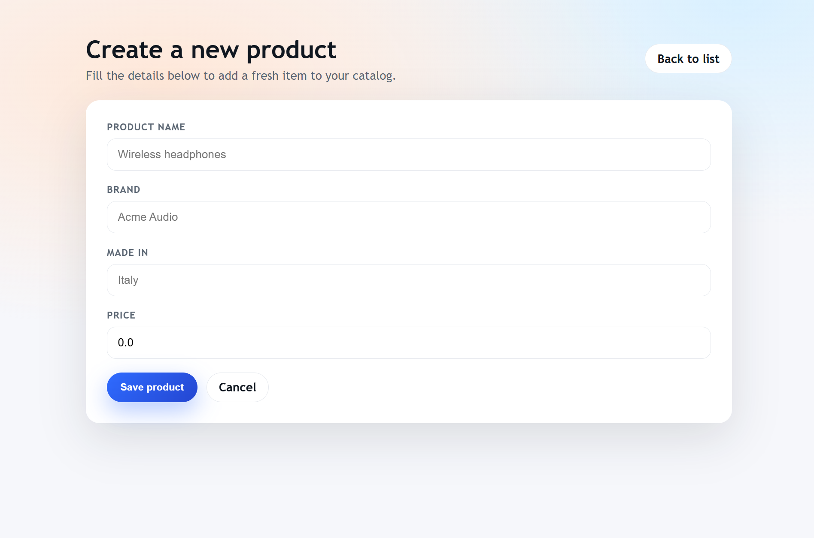

# Product Manager (Spring Boot + Thymeleaf)

Simple CRUD web app built with Spring Boot, Thymeleaf, Spring Data JPA, and PostgreSQL. It manages a list of products with create, edit, and delete flows.



## Features
- List all products on the home page
- Create a new product
- Edit an existing product
- Delete a product

## Tech stack
- Java 8
- Spring Boot 2.3.1
- Spring MVC + Thymeleaf
- Spring Data JPA (Hibernate)
- PostgreSQL
- Maven

## Project structure
- `src/main/java/net/codejava/AppController.java` - MVC routes and page wiring
- `src/main/java/net/codejava/Product.java` - JPA entity
- `src/main/java/net/codejava/ProductRepository.java` - Spring Data repository
- `src/main/java/net/codejava/ProductService.java` - CRUD service
- `src/main/resources/templates/` - Thymeleaf templates
- `src/main/resources/application.properties` - datasource configuration

## Prerequisites
- Java 8 (or compatible)
- Maven
- PostgreSQL running locally

## Database setup
The app expects a PostgreSQL database named `salesdb` and uses explicit schema (no auto DDL).

Default connection settings in `src/main/resources/application.properties`:
```
spring.datasource.url=jdbc:postgresql://localhost:5432/salesdb
spring.datasource.username=appuser
spring.datasource.password=appsecret
```

Create the database, role, and table by running:
```
psql -U postgres -h localhost -f db/init_postgres.sql
```

## Run the app
From the project root:
```
./mvnw spring-boot:run
```

Then open:
```
http://localhost:8080/
```

## Routes
- `GET /` - list products
- `GET /new` - new product form
- `POST /save` - save product
- `GET /edit/{id}` - edit product form
- `GET /delete/{id}` - delete product

## Notes
- The app uses `spring.jpa.hibernate.ddl-auto=none`, so the table must exist before running.
- Change database credentials and URL as needed for your environment.
